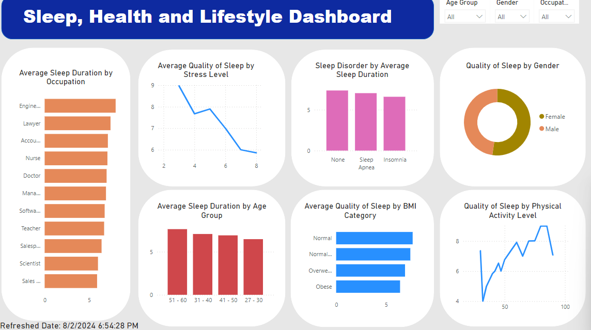
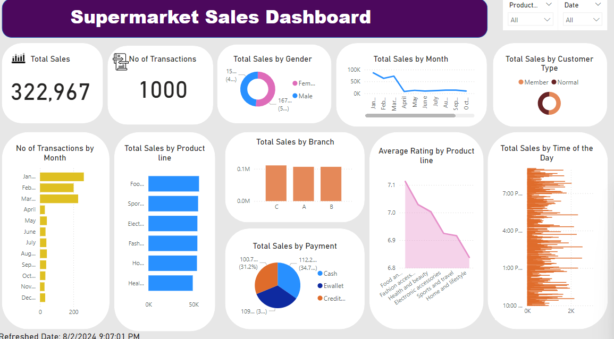
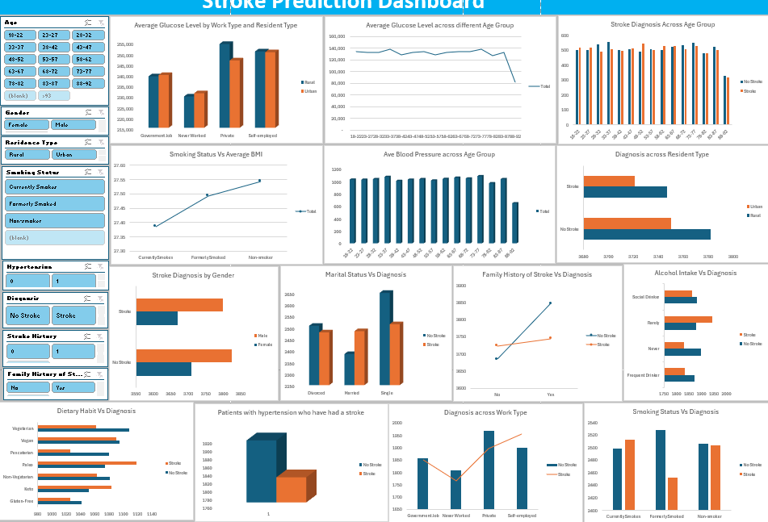
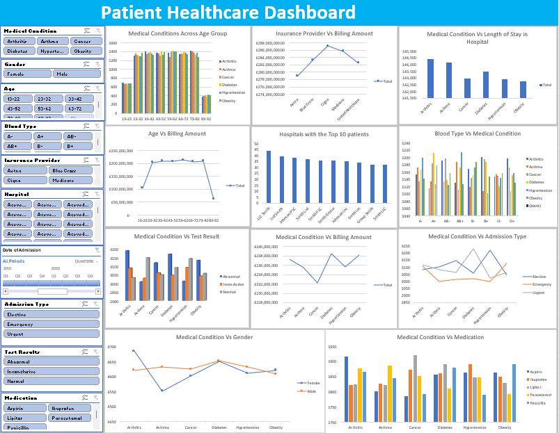

# Data Analytics Portfolio
# Project 1
**Title:** [Sleep, Health, and Lifestyle Dashboard](https://github.com/Oluwatbo/oluwatbo.github.io/blob/main/Sleep_Health_Lifestyle%20Dataset.pbix)

**Tools Used:** Powerbi, Power Query Editor, Slicers, Conditinal Formating, DAX, Data Cleansing, Data Modelling

**Project Description:** The objective is to understand the relationship between sleep habits, health conditions, and lifestyle choices. This dataset provides insights into various aspects such as sleep duration, health conditions, physical activity levels, and demographic factors. By analysing this data, I aim to uncover patterns and correlations that could inform health recommendations and lifestyle improvements. The dataset includes information on sleep patterns, health metrics, lifestyle factors, and demographics.The key variables are sleep duration, sleep quality, physical activity, health conditions (e.g., BMI Category, Blood Pressure), lifestyle choices (e.g., physical activity level, stress level), and demographic factors (e.g., age, gender).

**Key Findings:** Column chart showing short sleep duration is associated with higher prevalence of Sleep Apnea and Insomnia.
                  Line chart showing participants who engage in regular physical activity report better sleep quality.
                  Line chart and bar chart showing participants with high stress level and obese BMI respectively are correlated with poorer sleep quality.
                  Column chart showing Age Group 51-60 have a higher tendency towards adequate sleep duration compared to other age groups.
                  Bar chart showing participants who are Engineers have the longest sleep duration compared to other occupations.
                  Donut chart showing female participants tends to have more quality of sleep than male participants.

**Dashboard Overview:**

# Project 2
**Title:** [Customer Sales Data]

**SQL Code:** [SQL Query](https://github.com/Oluwatbo/oluwatbo.github.io/blob/main/Sales_Data.SQL)

**SQL Skills Used:** For Data Retrieval: 
                      SELECT queries to fetch specific data from tables.
                      FROM to specify the table.
                      JOIN operations to combine data from multiple tables.
                      ON to specify two coumns from multiple tables that are the same.
                      WHERE clauses for filtering data based on specific conditions.
                      CROSS JOIN to combine each row of one table with each row of another table, and return the Cartesian product of the sets of rows from the tables that are joined.
                     For Data Filtering and Sorting:
                      ORDER BY for sorting data.
                      
**Project Description:** The project aims to analyse the relationships and performance metrics across sales, customers, and orders. By utilising SQL to interact with the database, the project focuses on extracting valuable insights such as sales performance, customer demographics, product popularity, and operational efficiency.

**Technology Used:** SQL Server

# Project 3
**Title:** [Supermarket Dashboard](https://github.com/Oluwatbo/oluwatbo.github.io/blob/main/Supermarket%20Sales%20Dashboard.pbix)

**Tools Used:** Powerbi, Power Query Editor, Slicers, Conditinal Formating, DAX, Data Cleansing, Data Modelling

**Project Description** The primary goal is to analyse the sales performance across different branches, product lines, customer demographics, and payment methods. The analysis will assist to uncover patterns, trends, and insights in making business decisions to optimise operations, improve customer satisfaction, and increase profitability.

Sales Analysis:
Assess total sales and number of transactions across different product lines, branches, and payment methods.
Identify peak sales periods and low-performing times.

Customer Insights:
Segment customers based on demographics such as gender and member status.

Product and Category Performance:
Determine the best-selling product line.
Determine the average rating by product line.

Operational Efficiency:
Measure the payment methods' popularity.

**Key Findings** Bar chart and column chart showing sales distribution by branch and product line. 
Insights: Identified the top-performing branches and popular product lines as Branch C and the "Food and beverages" category respectively.

Customer Demographics: Donut charts displayed the customer segments by gender and membership.
Insights: Identified the female customer segment is a bit higher than the male customer segment, and the proportion of members versus non-members is almost the same. 

Sales Trends Over Time: Line charts and bar charts showing sales trends on a monthly and time basis.
Insights: Identified peak sales month as "January" and time as "10:33AM" during the day, and analyse the trends.

Payment Methods and Transaction Analysis: Pie charts showing the distribution of payment methods.
Insights: Identified Cash payment methodas the most popular, which can guide payment processing decisions.

Product Rating: Area chart showing the ratings by product line
Insights: Identified the "Food and beverages" category having the highest average rating.

**Dashboard Overview**

# Project 4
**Title:** [Car Dealer Sales]

**SQL Code:** [SQL Query](https://github.com/Oluwatbo/oluwatbo.github.io/blob/main/Car_Dealer.SQL)

**SQL Skills Used:** For Data Retrieval: 
                      SELECT queries to fetch specific data from tables.
                      FROM to specify the table.
                      WHERE clauses for filtering data based on specific conditions.
                      GROUP BY for aggregating data and calculating the COUNT metrics.
                      HAVING for filtering groups based on aggregate calculations.
                     For Data Aggregation and Analysis:
                      Used aggregate functions like COUNT() to summarise data

**Project Description:** To develop a comprehensive database management system for a second-hand car dealership. The aim is to manage inventory and sales transactions efficiently.

Inventory Management: Track and manage available vehicles, including details such as the fuel type(petrol, diesel, and CNG), year, selling price, and condition.

Sales Transactions: Record sales transactions, including customer details, vehicle sold, price, and sales date.

Reporting and Analytics: Generate reports on sales performance and inventory status.

Analyse sales trends.

**Technology Used:** SQL Server

# Project 5
**Title:** [Stroke Prediction Dashboard](https://github.com/Oluwatbo/oluwatbo.github.io/blob/main/Stroke%20Prediction%20Dataset.xlsx)

**Tools Used:** Microsoft Excel, Data Import and Cleansing, Pivot Tables, Data Visualisation through Bar, Line, and Pie charts, Slicers, Conditional Formatting

**Project Description:** This project is to analyse and visualise various factors that may influence the likelihood of stroke occurrence. The dataset includes demographic information, medical history, and lifestyle factors of individuals. The dashboard aims to identify patterns and correlations between these factors and stroke diagnosis, providing insights that could inform healthcare decisions and preventive measures.

**Key Findings:** Highest stroke incidence was observed in age group "48 - 52" while the lowest stroke diagnoses was in age group "88 - 92".
                  Males showed a higher incidence of stroke compared to females.
                  Individuals in rural areas showed a higher rate of stroke diagnoses compared to those in urban areas.
                  Paleo dietary habit and singles were more prevalent among stroke patients.
                  A significant portion of stroke patients had a history of hypertension and a family history of stroke.
                  Current smokers and rarely drinkers exhibited a higher likelihood of stroke.
                  Stroke rates varied across different work types, with self-employed and private sector employees showing distinct patterns in health metrics.

**Dashboard Overview:**

# Project 6
**Title:** [Patient Healthcare Dashboard](https://github.com/Oluwatbo/oluwatbo.github.io/blob/main/Patient%20Healthcare%20Dataset.xlsx)

**Tools Used:** Microsoft Excel, Data Import and Cleansing, Pivot Tables, Data Visualisation through Bar, Line, and Pie charts, Slicers, Conditional Formatting, SUM()

**Project Description:** The project involves creating a comprehensive dashboard using Excel to analyse and visualise patient healthcare data. The data encompasses various patient demographics, medical conditions, billing information, insurance providers, hospital stays, and other relevant metrics. The primary aim is to provide insights into patient healthcare trends and identify key patterns that can inform decision-making in medical and administrative processes.

**Key Findings:** Higher prevalence of certain conditions, such as hypertension and diabetes, in older age groups.
                  Aetna insurance provider has the lowest billing amount.
                  Evident that certain conditions, such as Arthritis, Asthma and Diabetes diseases, are associated with longer hospital stays compared to others.
                  The chart suggests that billing amounts tend to increase with age, likely due to more complex health issues and more intensive treatments. However, there was a sharp decrease in billing amounts for "83 - 92" age group.
                  Hospitals that have the highest number of patients, providing insights into patient distribution across healthcare facilities.
                  A breakdown of medical conditions by blood type reveals no significant correlation, suggesting that blood type does not influence the prevalence of specific conditions.
                  The relationship between medical conditions and test results, with certain conditions like Arthritis and diabetes showing more abnormal test results.
                  The variability in billing amounts across different medical conditions, with some conditions, such as diabetes, generally incurring higher costs.
                  Diabetes has the most "urgent" admission type, hypertension has the most "elective" admission type, while the obesity has the most "emergency" admission type.
                  Arthritis is more common in females while asthma and cancer are more common in males.
                  More aspirin was used to treat Arthritis, more paracetamol for asthma, more lipitor for cancer and diabetes, more ibuprofen for hypertension, and more penicillin for obesity.      

**Dashboard Overview:**

